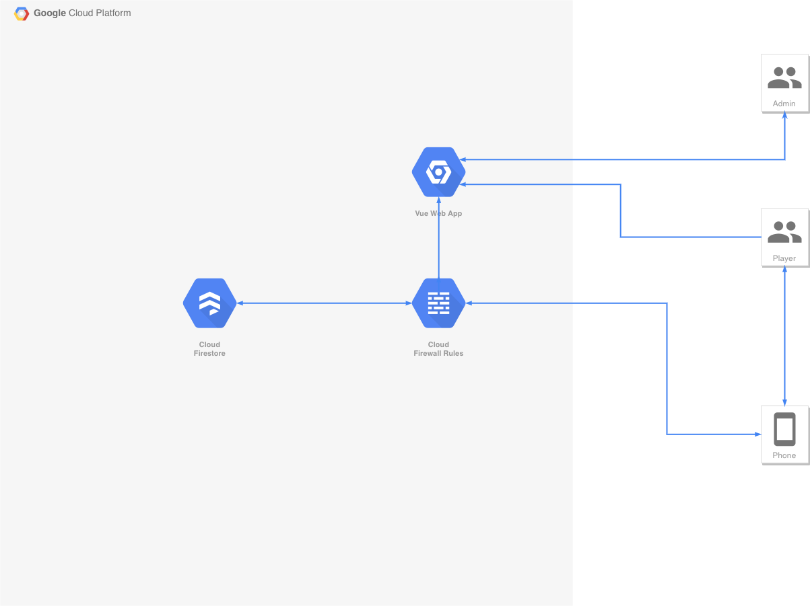
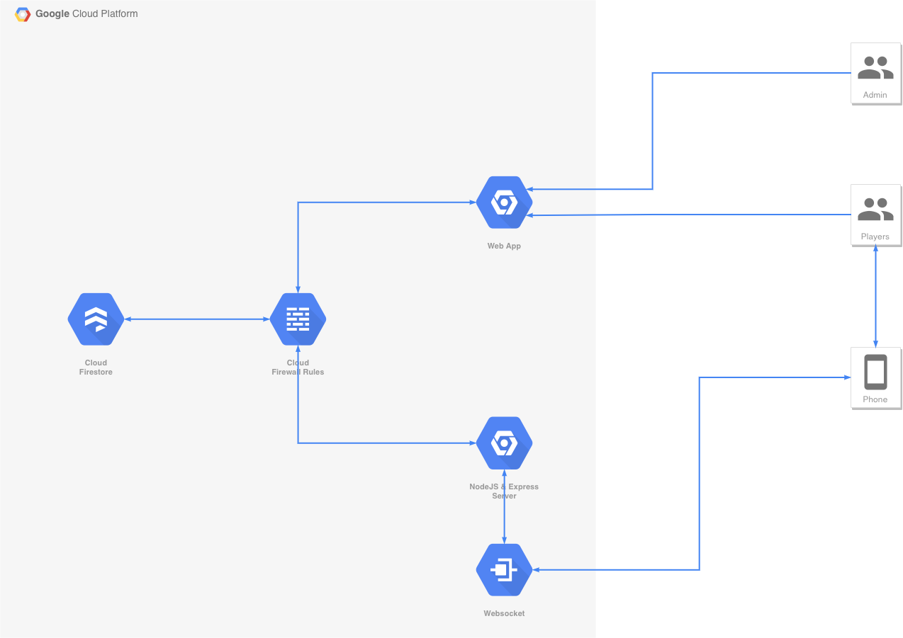

# battle-bots
A web-based top down shooter for educational purposes to teach android students how to integrate with network protocols. 

## Architecture
The two current options for architecture are either a direct connection to the Firebase Real-time Database or websocket connections via a NodeJS/Express backend. See Diagrams for further details.

### Direct Firebase Realtime Database Connection


### NodeJS & Express Websocket Server


## Design

## Game Design


## Project setup
```
npm install
```

### Compiles and hot-reloads for development
```
npm run serve
```

### Compiles and minifies for production
```
npm run build
```

### Lints and fixes files
```
npm run lint
```

### Customize configuration
See [Configuration Reference](https://cli.vuejs.org/config/).
